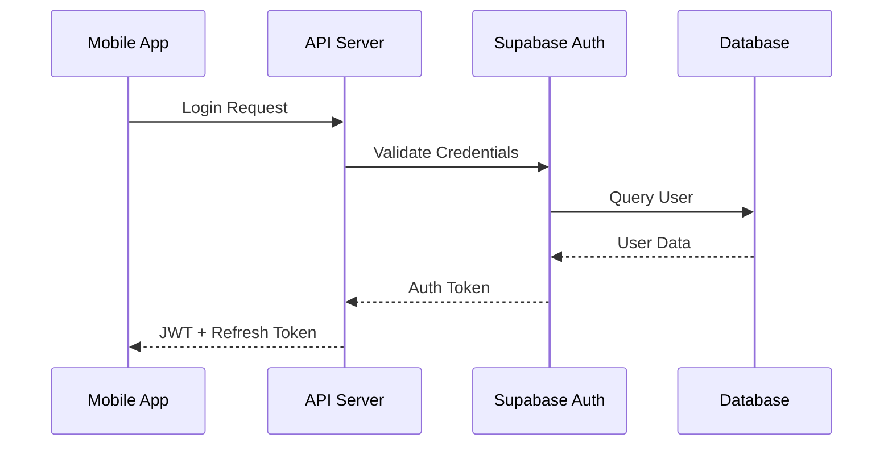
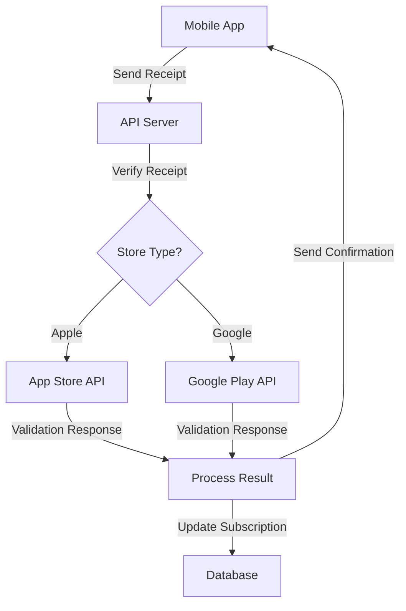
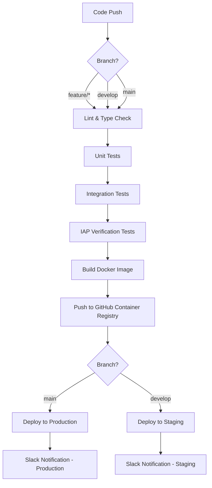

# Corp Astro API


## 🌐 Overview

The Corp Astro API is the backend server that powers the Corp Astro mobile application ecosystem. It provides essential services including user authentication, subscription management, real-time chat functionality, horoscope generation, personalized report creation, and user profile management.

**For non-developers:** This is the server-side component that handles all the behind-the-scenes operations for the Corp Astro mobile app. It processes data, manages user accounts, validates purchases, and delivers content to the mobile application.

### Key Technologies

- **Runtime Environment**: Node.js (v16+)
- **Framework**: Express 5 with TypeScript
- **Database**: PostgreSQL via Supabase
- **Authentication**: JWT-based with Supabase Auth
- **Real-time Communication**: Socket.IO for WebSockets
- **Push Notifications**: Firebase Cloud Messaging (FCM)
- **Containerization**: Docker & Docker Compose
- **Deployment**: DigitalOcean App Platform
- **CI/CD**: GitHub Actions

## 🏗️ System Architecture

```
┌─────────────────────────────────────────────────────────────────┐
│                      Corp Astro API Server                       │
├─────────────┬─────────────┬─────────────────┬──────────────────┤
│  Auth &     │ Subscription│  Content        │  Real-time       │
│  User Mgmt  │ Services    │  Services       │  Services        │
└──────┬──────┴──────┬──────┴────────┬────────┴────────┬─────────┘
       │              │               │                 │
       ▼              ▼               ▼                 ▼
┌─────────────┐ ┌──────────────┐ ┌───────────────┐ ┌────────────┐
│  Supabase   │ │ Apple/Google │ │ Report        │ │ Socket.IO  │
│  Auth & DB  │ │ IAP Services │ │ Generation    │ │ WebSockets │
└─────────────┘ └──────────────┘ └───────────────┘ └────────────┘
```

## 🛠️ Tech Stack

### Core Technologies
- **Runtime**: Node.js (v16+)
- **Framework**: Express 5 with TypeScript
- **API Documentation**: OpenAPI 3.0
- **Containerization**: Docker & Docker Compose

### Database & Storage
- **Primary Database**: PostgreSQL via Supabase
- **Caching Layer**: Redis
- **File Storage**: Supabase Storage

### Authentication & Security
- **Authentication**: JWT-based with Supabase Auth
- **API Security**: CORS, Helmet, Rate Limiting
- **Webhook Verification**: HMAC signature validation

### Background Processing
- **Job Queue**: BullMQ with Redis
- **Scheduled Tasks**: Node-cron

### Real-time Communication
- **WebSockets**: Socket.IO
- **Push Notifications**: Firebase Cloud Messaging (FCM)

## 📊 Data Flow Diagrams

### Authentication Flow


### Subscription Verification Flow


## 📁 Project Structure

```
corp-astro-api/
├── src/                      # Source code
│   ├── app.ts                # Express application setup
│   ├── server.ts             # HTTP & WebSocket server
│   ├── config/               # Configuration files
│   │   ├── env.ts            # Environment variables
│   │   ├── supabase.ts       # Supabase client
│   │   └── redis.ts          # Redis client
│   ├── controllers/          # Request handlers
│   │   ├── auth.ts           # Authentication
│   │   ├── horoscopes.ts     # Horoscope endpoints
│   │   ├── reports.ts        # Report endpoints
│   │   ├── subscriptions.ts  # Subscription management
│   │   └── users.ts          # User profile management
│   ├── middlewares/          # Express middlewares
│   │   ├── auth.ts           # JWT verification
│   │   ├── validation.ts     # Request validation
│   │   └── error.ts          # Error handling
│   ├── routes/               # API route definitions
│   ├── services/             # Business logic
│   │   ├── auth/             # Authentication services
│   │   ├── iap/              # In-App Purchase verification
│   │   ├── horoscope/        # Horoscope generation
│   │   ├── reports/          # Report generation
│   │   └── notifications/    # Push notification services
│   ├── sockets/              # WebSocket handlers
│   ├── types/                # TypeScript type definitions
│   └── workers/              # Background job workers
├── docker/                   # Docker configuration files
├── scripts/                  # Utility scripts
├── .env.example              # Example environment variables
├── docker-compose.yml        # Docker Compose configuration
├── Dockerfile                # Docker configuration
├── package.json              # Project dependencies
└── tsconfig.json             # TypeScript configuration
```

## 🔑 Key Features Explained

### 1. Authentication System

The authentication system uses Supabase Auth with JWT tokens and implements:

- **Secure Login/Registration**: Email/password and social auth
- **Token Management**: JWT access tokens with refresh token rotation
- **Password Recovery**: Secure password reset flow
- **Session Management**: Device tracking and forced logout capabilities

**Key files:**
- `src/controllers/auth.ts` - Authentication endpoints
- `src/services/auth/tokens.ts` - JWT handling
- `src/middlewares/auth.ts` - Authentication middleware

### 2. Subscription Management

The subscription system handles in-app purchases from both Apple App Store and Google Play Store:

- **Receipt Verification**: Server-to-server validation with Apple/Google
- **Subscription Tracking**: Status, expiration, and renewal handling
- **Webhook Processing**: Real-time subscription event handling
- **Entitlement Management**: Feature access based on subscription level

**Key files:**
- `src/services/iap/apple.ts` - App Store receipt verification
- `src/services/iap/google.ts` - Google Play receipt verification
- `src/controllers/subscriptions.ts` - Subscription endpoints

### 3. Report Generation System

The report generation system creates personalized astrological reports:

- **Asynchronous Processing**: Background job queue for report generation
- **Multiple Report Types**: Natal, compatibility, transit reports
- **PDF Generation**: Professional PDF creation with PDFKit
- **Secure Storage**: Report storage with expiring download links

**Key files:**
- `src/services/reports/generator.ts` - Report creation logic
- `src/workers/reportWorker.ts` - Background processing
- `src/controllers/reports.ts` - Report endpoints

### 4. Real-time Communication

The real-time system handles chat and notifications:

- **WebSocket Connections**: Real-time bidirectional communication
- **Chat History**: Message storage and retrieval
- **Push Notifications**: FCM integration for mobile alerts
- **Typing Indicators**: Real-time user activity status

**Key files:**
- `src/sockets/chatHandler.ts` - WebSocket chat handlers
- `src/services/notifications/fcm.ts` - Firebase messaging

## 🚀 Getting Started

### Prerequisites

- **Node.js** (v16+)
- **npm** or **yarn**
- **Redis** (local or remote instance)
- **Supabase** account
- **Docker** (optional, for containerized development)

### Installation

1. **Clone the repository**
   ```bash
   git clone https://github.com/Project-Corp-Astro/Dif_API.git
   cd Dif_API
   ```

2. **Install dependencies**
   ```bash
   npm install
   ```

3. **Set up environment variables**
   ```bash
   cp env.example .env
   # Edit .env with your credentials
   ```

4. **Start the development server**
   ```bash
   npm run dev
   ```

### Using Docker

For containerized development with all dependencies:

```bash
docker-compose up
```

This will start the API server along with Redis and any other required services.

## 📊 API Documentation

The API is fully documented using OpenAPI 3.0 specification:

- **Development**: Access the Swagger UI at `http://localhost:3000/api-docs` when running locally
- **Source**: View the OpenAPI specification at `openapi.yaml`

## 🔄 Database Management

### Schema


The database uses a relational model with the following core tables:

- **users**: User accounts and profile information
- **subscriptions**: User subscription status and history
- **reports**: Generated astrological reports
- **horoscopes**: Daily horoscope content
- **chat_messages**: User chat history

### Migrations

Database migrations are managed through SQL files:

```bash
npm run migrate
```

## 🧪 Testing

### Running Tests

```bash
# Run all tests
npm test

# Run specific test suite
npm test -- --testPathPattern=subscriptions

# Run with coverage report
npm test -- --coverage
```

### Test Structure

Tests are organized by feature and include:

- **Unit Tests**: Testing individual functions and methods
- **Integration Tests**: Testing API endpoints and service interactions
- **Mock Services**: Simulated external services (Apple/Google APIs)

## 🔄 CI/CD Pipeline

The project uses GitHub Actions for continuous integration and deployment, with Docker for containerization and DigitalOcean for hosting.

### CI/CD Workflow Overview



### Deployment Environments

| Environment | Branch | Domain | Description |
|-------------|--------|--------|-------------|
| Production | `main` | api.corpastro.com | Live production environment |
| Staging | `develop` | staging-api.corpastro.com | Pre-production testing environment |

### CI/CD Workflow Stages

1. **Code Quality Checks**
   - ESLint for code style enforcement
   - TypeScript type checking
   - Security vulnerability scanning

2. **Testing**
   - Unit tests with Jest
   - Integration tests for API endpoints
   - IAP verification tests for Apple and Google payment validation

3. **Build Process**
   - Docker image build with optimized layers
   - Tagging with Git SHA and `latest` tags
   - Push to GitHub Container Registry (ghcr.io)

4. **Deployment**
   - DigitalOcean App Platform for container hosting
   - Zero-downtime deployments
   - Automatic rollbacks on failure
   - Environment-specific configurations

5. **Notifications**
   - Slack notifications on deployment completion
   - Detailed deployment status and logs

### Docker Build Configuration

The Docker build process uses a multi-stage approach to minimize image size and improve security:

```dockerfile
# Build stage (simplified example)
FROM node:18-alpine AS build
WORKDIR /app
COPY package*.json ./
RUN npm ci
COPY . .
RUN npm run build

# Production stage
FROM node:18-alpine
WORKDIR /app
COPY --from=build /app/dist ./dist
COPY package*.json ./
RUN npm ci --only=production
CMD ["node", "dist/index.js"]
```

### Environment Variables and Secrets

The CI/CD pipeline uses the following key secrets and environment variables:

| Secret/Variable | Purpose | Used In |
|----------------|---------|--------|
| `SUPABASE_URL` | Supabase API URL | Tests, IAP verification |
| `SUPABASE_SERVICE_KEY` | Supabase service role key | Tests, IAP verification |
| `JWT_SECRET` | JWT signing secret | Tests |
| `APPLE_WEBHOOK_SECRET` | Apple App Store webhook verification | IAP verification tests |
| `GOOGLE_WEBHOOK_SECRET` | Google Play webhook verification | IAP verification tests |
| `DIGITALOCEAN_ACCESS_TOKEN` | DigitalOcean API access | Deployment steps |
| `DIGITALOCEAN_APP_ID` | Production app identifier | Production deployment |
| `DIGITALOCEAN_STAGING_APP_ID` | Staging app identifier | Staging deployment |
| `SLACK_WEBHOOK_URL` | Slack notification endpoint | Deployment notifications |

### Security Considerations

- **Secret Management**: All API keys and credentials are stored in GitHub Secrets
- **Environment Variables**: Sensitive values are scoped at the step level in workflows to prevent unauthorized access
- **Container Security**: Docker images are scanned for vulnerabilities before deployment
- **Access Control**: Limited access to production deployment capabilities
- **Audit Logging**: All deployments are logged and tracked

### Deployment Commands

**Manual Deployment (if needed):**

```bash
# Install DigitalOcean CLI
brew install doctl

# Authenticate with DigitalOcean
doctl auth init

# Deploy to production
doctl apps create-deployment <DIGITALOCEAN_APP_ID>

# Deploy to staging
doctl apps create-deployment <DIGITALOCEAN_STAGING_APP_ID>
```

See `.github/workflows/ci-cd.yml` for the complete workflow configuration.

## 🔗 Integration with Mobile App

The API integrates with the [Corp Astro Mobile App](https://github.com/Project-Corp-Astro/Dif_Mobile) through:

1. **REST API**: HTTP endpoints for data operations
2. **WebSockets**: Real-time communication for chat and notifications
3. **Push Notifications**: FCM for delivering alerts to mobile devices

### 🔌 API Endpoints & Services

### Core Service Architecture

The API is organized into domain-specific controllers and services that handle different aspects of the application:

1. **Authentication Service**
   - JWT-based authentication with Supabase integration
   - Multi-provider auth support (Email, Apple, Google, Facebook)
   - Token refresh and validation mechanisms

2. **Subscription Service**
   - In-app purchase receipt validation for iOS and Android
   - Subscription status tracking and expiration management
   - Webhook handling for store notifications (App Store, Google Play)

3. **Horoscope Service**
   - Daily, weekly, and monthly horoscope generation
   - Personalized content based on user birth chart
   - Compatibility analysis between different signs

4. **Report Service**
   - Detailed astrological report generation
   - PDF creation and storage management
   - Report history and access control

5. **Notification Service**
   - Firebase Cloud Messaging (FCM) integration
   - Device registration and token management
   - Scheduled and triggered notifications

6. **Chat Service**
   - Real-time communication via WebSockets
   - Message history and persistence
   - User presence and typing indicators

### API Endpoint Reference

| Base Path | Description | Example Endpoints |
|-----------|-------------|-------------------|
| `/auth` | Authentication endpoints | `/login`, `/register`, `/refresh-token` |
| `/users` | User profile management | `/profile`, `/preferences` |
| `/subscriptions` | Subscription handling | `/validate`, `/status`, `/webhook` |
| `/horoscopes` | Horoscope content | `/daily`, `/weekly`, `/compatibility` |
| `/reports` | Astrological reports | `/generate`, `/download/:id` |
| `/notifications` | Device registration | `/register-device`, `/settings` |
| `/chat` | Real-time messaging | `/history`, `/send` |

## 📚 Additional Documentation

- [Firebase Setup Guide](./FIREBASE_SETUP.md) - FCM configuration instructions
- [Webhook Integration Guide](./docs/webhook-integration.md) - Setting up subscription webhooks
- [Deployment Guide](./docs/deployment.md) - Production deployment instructions

## 🔧 Environment Variables

Key environment variables required for the application:

| Variable | Description | Example |
|----------|-------------|---------|
| `PORT` | Server port | `3000` |
| `NODE_ENV` | Environment | `development` |
| `SUPABASE_URL` | Supabase project URL | `https://xxxx.supabase.co` |
| `SUPABASE_SERVICE_KEY` | Supabase service key | `eyJxx...` |
| `JWT_SECRET` | JWT signing secret | `your-secret-key` |
| `REDIS_URL` | Redis connection URL | `redis://localhost:6379` |
| `APPLE_SHARED_SECRET` | App Store secret | `abcdef123456` |
| `GOOGLE_SERVICE_ACCOUNT` | Google service account | `{"type":"service_account",...}` |

## 🤝 Contributing

1. Fork the repository
2. Create your feature branch: `git checkout -b feature/amazing-feature`
3. Commit your changes: `git commit -m 'Add some amazing feature'`
4. Push to the branch: `git push origin feature/amazing-feature`
5. Open a Pull Request

## 📞 Support

For questions or support, please contact the development team at dev@corpastro.com

## 🔗 Related Repositories

- [Corp Astro Mobile](https://github.com/Project-Corp-Astro/Dif_Mobile) - React Native mobile application

## 📄 License

This project is proprietary and confidential.
